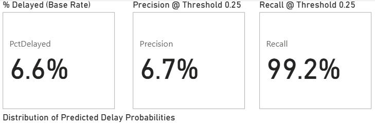
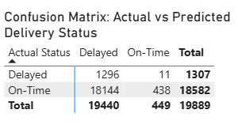
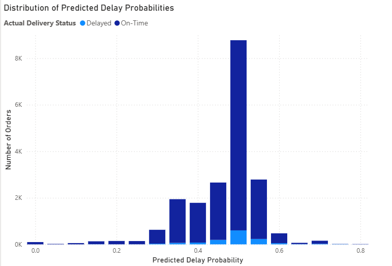

# 🚚 Delivery Delay Prediction Pipeline (AWS + Power BI)

This project builds an **end-to-end data pipeline and predictive model** for late delivery detection using the **Olist e-commerce dataset**. It demonstrates large-scale data handling on AWS, machine learning with XGBoost, and business-focused storytelling with Power BI.

---

## 💼 Problem Context

E-commerce companies face rising **customer dissatisfaction** due to late deliveries. The challenge is to **predict high-risk orders early** and trigger mitigation steps (e.g., expedited shipping, proactive customer notifications).

This project shows how cloud-scale data + ML can solve operational pain points.

---

## 📌 Executive Summary

- **Data Scale**: Processed 5M+ Olist transactions on AWS (S3 + Glue + Athena).  
- **Model**: Trained XGBoost with imbalance handling, tuned for **recall priority**.  
- **Results**: Base delay ≈ **6.6%**, **Recall ≈ 99%**, **Precision ≈ 6.7%**, **AUC ≈ 0.585**.  
- **Visualization**: Delivered an interactive Power BI dashboard (KPIs, confusion matrix, distribution analysis).  

> **Business takeaway**: Use as an *early-warning system* to flag risky orders, reducing missed delays.

---

## 🛠️ Tech Stack

- **Cloud & Data**: AWS S3, AWS Glue (PySpark), AWS Athena (SQL)  
- **Machine Learning**: XGBoost (threshold tuning, imbalance handling)  
- **Visualization**: Power BI (KPI cards, confusion matrix, histograms)  
- **Optional Ops**: FastAPI endpoint, AWS Step Functions, QuickSight  

---

## 📁 Project Structure

- `aws_pipeline/` — Glue scripts & Athena SQL for ETL  
- `model/` — XGBoost training, feature engineering, export  
- `powerbi/` — Dashboard walkthrough & visuals  

--- 

## 🌟 Key Results Summary

| Metric                  | Value   |
|--------------------------|---------|
| Base Delay Rate          | ~6.6%   |
| Recall (t=0.25)          | ~99%    |
| Precision (t=0.25)       | ~6.7%   |
| AUC                      | ~0.585  |

---

## 📊 Visual Highlights & Insights

### KPI Cards
 
> Shows overall base delay rate (~6.6%). Recall-focused threshold ensures nearly all late orders are flagged.

### Confusion Matrix

> Captures almost all delayed orders (low FN) at the cost of more false positives — appropriate in logistics risk contexts.

### Delay Probability Distribution

> Visualizes how predictions cluster, highlighting mid-range uncertainty where business rules can intervene.

---

## ⚠️ Limitations & Future Work

- Precision is low due to extreme recall bias — future work will explore **threshold tuning dashboards** in Power BI.  
- Feature importance (e.g., shipping distance, product type) to be visualized for transparency.  
- Deployment as **FastAPI service** for real-time integration with e-commerce systems.  

---

## 🔗 Author

**Ethan Choo**  
📍 Singapore | 🎓 Data Science & Business Analytics Graduate (SIM-UOL)  
🔗 [LinkedIn](https://www.linkedin.com/in/ethanchoo5/) | 🔗 [GitHub](https://github.com/ethan-analytics)
